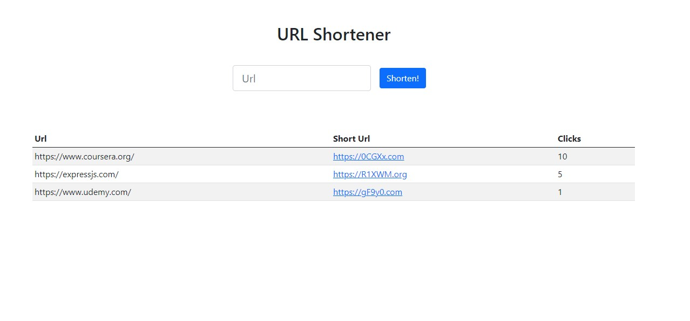

# (fake) URL-Shortener build with NodeJS, Express, EJS & MongoDB

# Live demo

> https://url-shortener-rc.herokuapp.com/



## Table of contents

- [General info](#general-info)
- [Code Examples](#code-examples)
- [Features](#features)
- [Contact](#contact)

## General info

So... it was Friday when I started coding this app, and what does that mean? It's Node Day!

Following some examples. I build by myself, an URL-Shortener fake app.
Why Fake? because the links only work if you click it from the actual app (whithout paste it anywhere), check the code.

This is a very easy and basic app that I build to refresh some Node, Express, EJS, and MongoDB basics that I think are important to keep a strong base to adventure to some more advanced topics.

## Code Examples

./config/routes.js

```
import express from 'express';
import indexPostController from '../Controllers/indexPostController.js';
import indexGetController from '../Controllers/indexGetController.js';
import idGetController from '../Controllers/idGetController.js';

const router = express.Router();

router.get('/', indexGetController, (req, res) => {
  const urlList = res.allUrl;

  res.render('index', urlList ? { urlList } : null);
});

router.post('/', indexPostController, (req, res) => {
  res.redirect('/');
});

router.get('/:shortUrl', idGetController, (req, res) => {
  res.redirect(res.fullUrl);
});

export default router;
```

## Features

You can:

- Add an URL
- Cick on the generated short Link to go to that website
- See how Clicks count gets updated everytime you click on a specificik link

## Technology used

The project is created with:

- node
- express
- dotenv
- nodemon
- nanoid
- EJS
- mongodb
- mongoose

## Contact

Created by Cudi - feel free to contact me!
